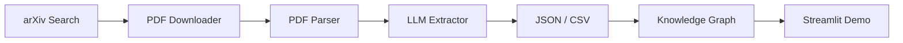
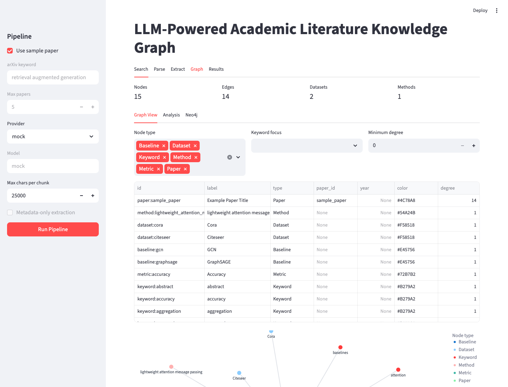

# LLM-Powered Academic Literature Analyzer & Knowledge Graph

[](https://www.python.org/)
[](https://streamlit.io/)
[](https://networkx.org/)
[](https://openrouter.ai/)

An end-to-end research paper mining pipeline that searches arXiv, parses PDFs, extracts structured research metadata with LLMs, and builds an interactive literature knowledge graph.

The project is designed as a practical research tool rather than a generic summarizer: it turns unstructured academic papers into schema-validated JSON/CSV records and graph relationships between papers, datasets, methods, baselines, metrics, and keywords.

## Pipeline



## Highlights

- End-to-end Python pipeline for literature retrieval, PDF parsing, LLM extraction, graph construction, and demo exploration.
- Chunk-based extraction: cleaned PDF text is split into paper sections such as Abstract, Introduction, Method, Experiments, Limitations, and Conclusion before LLM extraction and final JSON merging.
- Schema-first extraction for arXiv IDs, venue/source, task, method names, contributions, research problems, methods, datasets, baselines, metrics, results, limitations, future work, citation context, related papers, keywords, and field-level confidence.
- Mock provider for local smoke tests without API keys or network calls to LLM providers.
- NetworkX graph exports plus configurable alias mapping, analysis reports for dataset, metric, keyword, connected-paper, and shared-benchmark rankings, and Neo4j Cypher/direct-write support.
- Streamlit dashboard for Search, Parse, Extract, Graph, and Results workflows.
- Versioned JSON artifacts: `papers.json` and `graph_analysis.json` include schema version, prompt hash, provider/model, and run timestamp metadata.

## Quickstart

```bash
python3 -m venv .venv
source .venv/bin/activate
pip install -r requirements.txt
python -m src.pipeline --sample
streamlit run app/streamlit_app.py
```

The mock extractor uses `examples/sample_paper.txt`, so the project can be verified from a clean clone without downloading PDFs or configuring an API key.

## Example Output

```json
[
  {
    "paper_id": "2301.00000",
    "arxiv_id": "2301.00000",
    "venue_or_source": "arXiv",
    "title": "Example Paper Title",
    "authors": ["First Author", "Second Author"],
    "year": "2023",
    "abstract": "This paper studies graph neural networks for node classification.",
    "task": "node classification",
    "method_name": "lightweight attention message passing",
    "contributions": ["Combines neighborhood aggregation with a lightweight attention mechanism."],
    "research_problem": "The paper studies a specific research problem.",
    "motivation": "Existing methods have limitations that motivate this work.",
    "methodology": "The paper proposes a model or algorithm.",
    "datasets": ["Dataset A"],
    "baselines": ["Baseline A"],
    "metrics": ["Accuracy"],
    "main_results": "The proposed method improves over selected baselines.",
    "limitations": "The method has limitations discussed by the authors.",
    "future_work": "Future work is not specified in the sample.",
    "citation_context": "The paper compares against common graph neural network baselines.",
    "related_papers": ["GCN", "GraphSAGE"],
    "keywords": ["keyword one", "keyword two"],
    "confidence": {
      "datasets": 0.9,
      "baselines": 0.8,
      "metrics": 0.9,
      "methodology": 0.8
    }
  }
]
```

See [`examples/sample_output.json`](examples/sample_output.json) for a committed sample artifact.

## Streamlit Demo



Launch the dashboard:

```bash
streamlit run app/streamlit_app.py
```

The demo supports:

- Running the unified pipeline from the sidebar.
- Selecting mock, OpenRouter, or Gemini extraction.
- Configuring model, max papers, max characters per chunk, and metadata-only extraction.
- Viewing extracted papers in a table.
- Inspecting title, authors, abstract, research problem, methodology, datasets, baselines, metrics, limitations, future work, citation context, related papers, and quality score for one paper.
- Filtering by dataset, baseline, metric, keyword, task, node type, keyword focus, and minimum graph degree.
- Viewing graph analysis tabs for dataset, metric, keyword, connected-paper, and shared-benchmark rankings.
- Displaying the generated knowledge graph with native Streamlit/Altair rendering.
- Downloading extracted JSON/CSV, graph HTML, GraphML, nodes CSV, edges CSV, extraction failures, quality warnings, quality report, and Neo4j Cypher export.
- Viewing recent pipeline logs from `outputs/pipeline.log`.

## Online Demo Deployment

The app is ready to deploy on Streamlit Community Cloud, Render, or Hugging Face Spaces. For public demos, use the mock provider by default so no API keys are exposed.

Recommended Streamlit Community Cloud settings:

```text
Repository: kkkaa43/llm-literature-knowledge-graph
Branch: main
Main file path: app/streamlit_app.py
Python version: 3.11
```

Add provider API keys only as private platform secrets, never in code or committed files:

```text
OPENROUTER_API_KEY=...
GEMINI_API_KEY=...
```

Render deployment is also configured through [`render.yaml`](render.yaml). See [`docs/deployment.md`](docs/deployment.md) for both Streamlit Cloud and Render setup notes.

## Testing

Run the unit tests:

```bash
ruff check .
black --check .
python -m pytest tests
python -m src.pipeline --sample
```

Current test coverage includes:

- Filename sanitization.
- PDF text cleaning behavior, including section heading preservation.
- LLM JSON extraction and schema validation.
- Extraction quality warnings and failed-paper reporting.
- Section detection, quality scoring, knowledge graph node/edge construction, alias normalization, and graph analysis.
- Versioned artifact loading for both legacy list-style JSON and current metadata-wrapped JSON.
- arXiv retry behavior and per-paper download failure reporting.

## Full Pipeline Usage

The pipeline reads defaults from [`config.yaml`](config.yaml). Command-line arguments override config values.

Run the full pipeline with config defaults:

```bash
python -m src.pipeline
```

Run the full pipeline with command-line overrides:

```bash
python -m src.pipeline \
  --query "retrieval augmented generation" \
  --max-results 5 \
  --provider mock
```

Run the fixed regression paper set:

```bash
python -m src.pipeline \
  --id-file examples/regression_set.json \
  --provider mock
```

The committed regression set contains five stable arXiv papers across Transformers, BERT, retrieval-augmented generation, few-shot language modeling, and graph attention networks. Use it before demos or releases to compare extracted datasets, baselines, metrics, quality warnings, and graph relationships against a known corpus rather than only `examples/sample_paper.txt`.

Use a custom config file:

```bash
python -m src.pipeline --config path/to/config.yaml
```

Write logs to a custom path:

```bash
python -m src.pipeline --sample --log-path outputs/pipeline.log
```

Use OpenRouter for real LLM extraction:

```bash
cp .env.example .env
# Add OPENROUTER_API_KEY to .env
python -m src.pipeline \
  --query "retrieval augmented generation" \
  --max-results 5 \
  --provider openrouter \
  --model openai/gpt-4o-mini \
  --metadata-only
```

Use Gemini for real LLM extraction:

```bash
cp .env.example .env
# Add GEMINI_API_KEY to .env
python -m src.pipeline \
  --query "retrieval augmented generation" \
  --max-results 5 \
  --provider gemini \
  --model gemini-1.5-flash \
  --metadata-only
```

Run individual phases when debugging or iterating:

Search arXiv and download PDFs:

```bash
python -m src.arxiv_downloader --query "retrieval augmented generation" --max-results 5
```

Download the fixed regression set:

```bash
python -m src.arxiv_downloader --id-file examples/regression_set.json
```

Parse downloaded PDFs into cleaned text:

```bash
python -m src.pdf_parser
```

Run mock extraction:

```bash
python -m src.llm_extractor --provider mock
```

Run OpenRouter extraction:

```bash
cp .env.example .env
# Add OPENROUTER_API_KEY to .env
python -m src.llm_extractor --provider openrouter --model openai/gpt-4o-mini --metadata-only
```

Run Gemini extraction:

```bash
cp .env.example .env
# Add GEMINI_API_KEY to .env
python -m src.llm_extractor --provider gemini --model gemini-1.5-flash --metadata-only
```

Build graph outputs:

```bash
python -m src.knowledge_graph
```

Use a manual entity alias mapping:

```bash
python -m src.knowledge_graph \
  --input-path data/extracted/papers.json \
  --output-dir outputs \
  --alias-path config/entity_aliases.yaml
```

Write directly to Neo4j:

```bash
python -m src.knowledge_graph \
  --input-path data/extracted/papers.json \
  --output-dir outputs \
  --write-neo4j \
  --neo4j-uri bolt://localhost:7687 \
  --neo4j-user neo4j \
  --neo4j-password "$NEO4J_PASSWORD"
```

Generated graph files:

```text
data/extracted/papers.json
data/extracted/papers.csv
data/extracted/failed_papers.json
data/extracted/extraction_warnings.json
data/extracted/extraction_quality_report.json
outputs/graph.html
outputs/graph_interactive.html
outputs/graph.json
outputs/graph_analysis.json
outputs/graph.gexf
outputs/graph.graphml
outputs/nodes.csv
outputs/edges.csv
outputs/neo4j_import.cypher
outputs/neo4j_example_queries.cypher
outputs/pipeline.log
```

## Known Limitations

- Real LLM output depends on the selected provider/model, prompt version, temperature, and provider availability.
- PDF parsing quality can vary with paper layout, scanned content, equations, tables, headers, and multi-column formatting.
- arXiv search and PDF download are network-dependent; failed PDF downloads are recorded in `data/metadata/arxiv_download_failures.json`.
- Neo4j direct writes currently use generic `KGNode` nodes plus a `RELATED` relationship carrying the original relation name, while the Cypher export also includes typed labels and relationship names.
- The Streamlit graph view is optimized for small and medium result sets; large graphs should be filtered by node type, degree, keyword, or top-N before inspection.

## Release Checklist

- Rotate OpenRouter/Gemini/OpenAI keys before sharing demos.
- Run a secret scan, for example `git grep -nE "(sk-|OPENROUTER_API_KEY|GEMINI_API_KEY|OPENAI_API_KEY|api_key)"`.
- Clean generated data files that should not be committed.
- Update `docs/demo_screenshot.png` after UI changes.
- Run `ruff check .`, `black --check .`, `python -m pytest tests`, and `python -m src.pipeline --sample`.
- Confirm local checks pass before pushing.

## Project Structure

```text
.
├── app/
│   └── streamlit_app.py
├── data/
│   ├── extracted/
│   │   └── .gitkeep
│   ├── metadata/
│   │   └── .gitkeep
│   ├── raw_pdfs/
│   │   └── .gitkeep
│   └── text/
│       └── .gitkeep
├── examples/
│   ├── regression_set.json
│   ├── sample_output.json
│   └── sample_paper.txt
├── docs/
│   ├── deployment.md
│   ├── resume_bullets.md
│   └── demo_screenshot.png
├── outputs/
│   └── .gitkeep
├── prompts/
│   └── extraction_prompt.txt
├── src/
│   ├── arxiv_downloader.py
│   ├── json_validator.py
│   ├── knowledge_graph.py
│   ├── llm_extractor.py
│   ├── pipeline.py
│   ├── pdf_parser.py
│   ├── text_cleaner.py
│   └── utils.py
├── .env.example
├── .gitignore
├── render.yaml
├── runtime.txt
├── config.yaml
├── config/
│   └── entity_aliases.yaml
├── README.md
└── requirements.txt
```

## API Key Safety

- Keep real keys only in `.env`.
- Never commit `.env`, `.venv`, downloaded PDFs, parsed full-paper text, or real LLM outputs.
- Rotate any API key that was ever pasted into code, docs, notebooks, logs, screenshots, or chat.
- Before publishing, scan for secrets:

```bash
rg -n "[s]k-or-|[O]PENROUTER_API_KEY=.+|[G]EMINI_API_KEY=.+|[O]PENAI_API_KEY=.+|[A]uthorization|[B]earer" .
git check-ignore -v .env .venv data/raw_pdfs/example.pdf data/text/example.txt data/extracted/papers.json outputs/graph.html
```

Recommended committed artifacts:

```text
examples/sample_output.json
examples/sample_paper.txt
data/*/.gitkeep
outputs/.gitkeep
source code
prompts
README.md
requirements.txt
```

Recommended local-only artifacts:

```text
.env
.venv/
data/raw_pdfs/*.pdf
data/text/*.txt
data/metadata/*.json
data/metadata/*.csv
data/extracted/*.json
data/extracted/*.csv
outputs/*
```

## Resume Bullets

- Developed an end-to-end Python pipeline that retrieves arXiv papers, parses PDF text, extracts structured research metadata using LLM APIs, and builds an interactive literature knowledge graph.
- Implemented schema-validated LLM extraction with retry logic and quality reporting to identify research problems, methods, datasets, baselines, metrics, results, and limitations from unstructured academic papers.
- Built a NetworkX/PyVis knowledge graph and Streamlit dashboard to visualize relationships between papers, datasets, methods, benchmarks, metrics, and research keywords.

## Technical Challenges

- Noisy PDF parsing from academic layouts, page headers, footers, hyphenation, and section formatting.
- Long-context paper extraction where methods, experiments, and limitations may appear far apart.
- LLM JSON reliability through schema validation, missing-field retries, quality warnings, failed-paper logging, and mock-mode testability.
- Entity normalization for graph construction, such as dataset, metric, and method naming variants.

## Future Work

- Add automated regression diff reports that compare key extracted datasets, baselines, metrics, and graph relationships over time.
- Add richer Neo4j direct writes that use typed relationship names and labels while preserving idempotent imports.
- Add click-to-select behavior in the graph once Streamlit's chart event API is stable enough for this use case.
- Extend entity alias maintenance with project-specific mappings for more datasets, metrics, methods, and benchmark suites.
